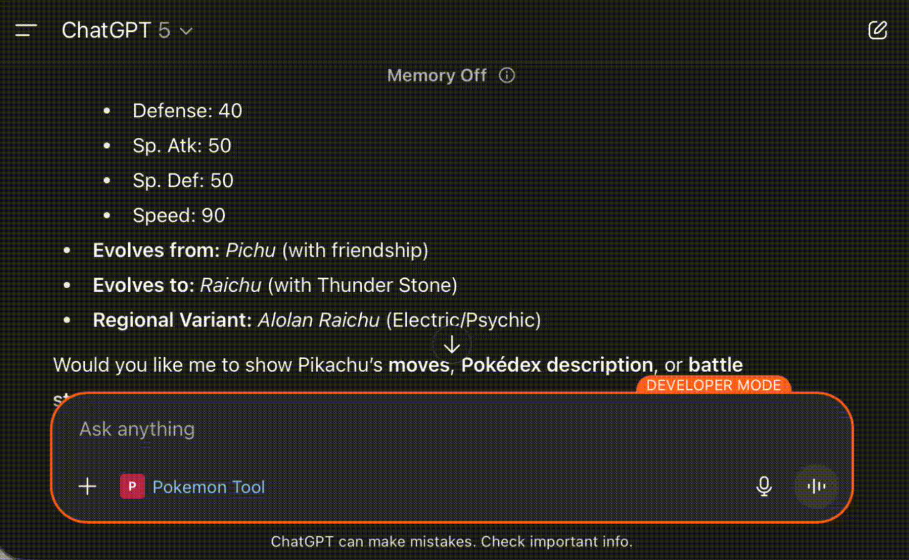

# Chat GPT App Demo

A demo of creating an app for Chat GPT with the [Apps SDK](https://developers.openai.com/apps-sdk).

- For more details, please refer to my article [Build An App for ChatGPT! Step By Step!](https://medium.com/@itsuki.enjoy/build-an-app-for-chatgpt-step-by-step-814d46961ea4).

Specifically, this demo consists of two parts.
1. A MCP Server with Streamable HTTP exposing tools that the model can call, and packaging the structured data plus component HTML that the ChatGPT client renders inline
2. A React app for building custom UI/UX for rendering components that turns structured tool results into a human-friendly UI

## Deploy
1. Run `npm install` in both [server](./server/) and [web](./web/) to install necessary dependency
2. Build the web by running `npm run build`. This will compile the react app into a single JS/CSS module, as well as generating an HTML to be used as MCP Server resource.
3. Start the MCP Server by runing `npm run start`. This will start the MCP server listening to `http://localhost:3000/mcp`
4. Create a tunnel to map localhost to https by running `ngrok http 3000`.
5. Create a [ChatGPT Conenctor](https://help.openai.com/en/articles/11487775-connectors-in-chatgpt) From [ChatGPT Console](https://chatgpt.com/) to connecting to the mcp endpoint, for example `https://34657b79d559.ngrok-free.app/mcp`.

We can then start chatting with ChatGPT to test the app out.

